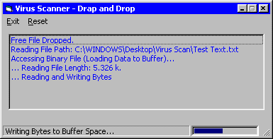



## Virus Scanner \(Real\)

### Description

Drag and Drop a Free File onto the List Box. The Application opens the File as Binary and loads it into Buffer Space and scans the contents for Virus Strings. Very easy to do, and commented. It only does a single file right now, looking to add Directories upcoming.
 
### More Info
 

             |
---                |---
**Submitted On**   |2001-07-31 23:07:28
**By**             |[Genosyde](https://github.com/Planet-Source-Code/PSCIndex/blob/master/ByAuthor/genosyde.md)
**Level**          |Intermediate
**User Rating**    |4.8 (24 globes from 5 users)
**Compatibility**  |VB 5\.0, VB 6\.0
**Category**       |[String Manipulation](https://github.com/Planet-Source-Code/PSCIndex/blob/master/ByCategory/string-manipulation__1-5.md)
**World**          |[Visual Basic](https://github.com/Planet-Source-Code/PSCIndex/blob/master/ByWorld/visual-basic.md)
**Archive File**   |[Virus Scan238487312001\.zip](https://github.com/Planet-Source-Code/genosyde-virus-scanner-real__1-25706/archive/master.zip)

